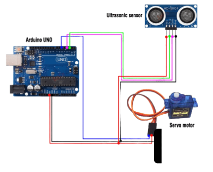
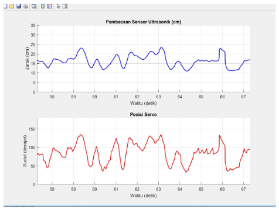

# DESCRIPTION

This project implements a PID (Proportional–Integral–Derivative) control system on a ball balancer. The system is designed to keep a ball at the center of a balancing platform automatically. An Arduino Uno reads the ball position using an ultrasonic sensor and adjusts the platform angle via a servo motor based on PID calculations. This project aims to demonstrate how PID control can maintain stability in a dynamic system.

# Tools & Materials
1. Arduino Uno
2. Ultrasonic Sensor (HC-SR04)
3. Servo Motor
4. Breadboard
5. Jumper Wires
6. Foam Board (for structure)
7. Glue Gun & Wire
8. Ball balancing platform

# How It Works
1. The ultrasonic sensor measures the position of the ball on the platform.
2. The Arduino calculates the error between the ball position and the center point.
3. The PID controller processes this error (Proportional, Integral, Derivative).
4. The servo motor adjusts the tilt of the platform accordingly.
5. The system continuously updates in real-time to keep the ball balanced at the center.

# Steps
1. Build the mechanical structure using foam board and wire as the balancing platform.
2. Install the servo motor to control the tilt of the platform.
3. Mount the ultrasonic sensor to detect the ball position.
4. Connect all components to the Arduino using a breadboard and jumper wires.
5. Upload the PID control program to the Arduino.
6. Tune the PID parameters (Kp, Ki, Kd) to achieve stable balancing.
7. Test and observe the system response to ensure the ball stays at the center.

# Hardware Configuration

| Component         | Pin on Component | Arduino Pin     |
| ----------------- | ---------------- | --------------- |
| Ultrasonic Sensor | VCC              | 5V              |
| Ultrasonic Sensor | GND              | GND             |
| Ultrasonic Sensor | TRIG             | Digital 2       |
| Ultrasonic Sensor | ECHO             | Digital 3       |
| Servo Motor       | VCC              | 5V              |
| Servo Motor       | GND              | GND             |
| Servo Motor       | Signal           | Digital 5 (PWM) |

Notes:
1. The ultrasonic sensor uses TRIG (D2) to send signals and ECHO (D3) to receive reflected waves for distance measurement.
2. The servo motor is controlled using PWM signal on pin D5 to adjust the platform angle.
3. Both components share the same 5V and GND from the Arduino to ensure stable operation.
   
# Code
Code Structure : 
1. Arduino Code: `code/arduino/pid_ball_balancer.ino`
2. MATLAB Visualization: `code/matlab/pid_visualization.m`

# Documentation :
1. ### Circuit Diagram

### MATLAB Visualization

### 🎯 Result

